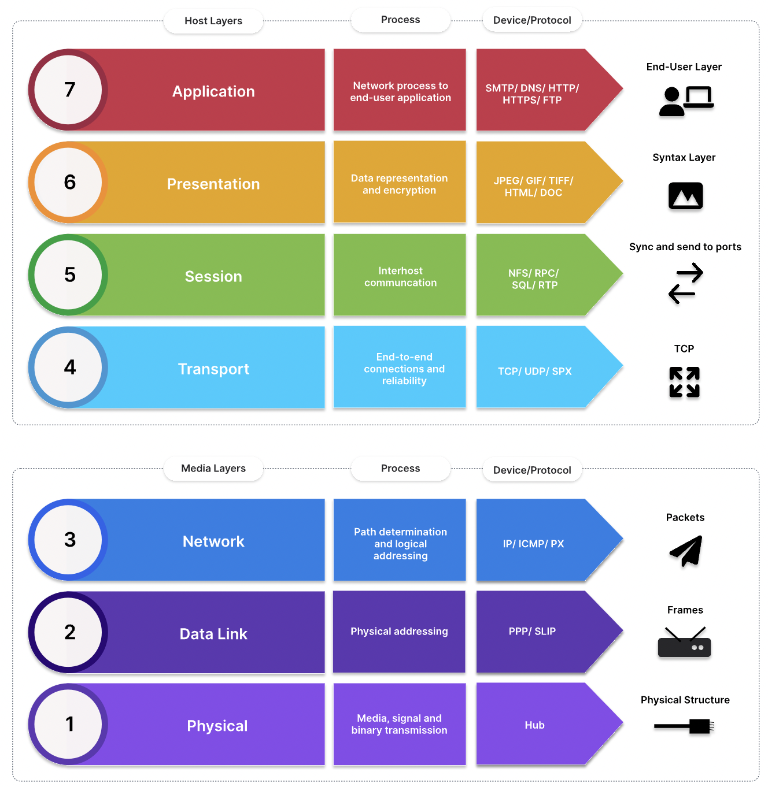

## OSI model

  

## Classification of network by geography

  

#### LAN: Local area network

  

#### WAN: Wide area network

  

#### MAN: Metropolitan area network

  

#### CAN: Campus area network

  

#### PAN: Personal area network

  

## IP address
IPv4 address is a 32 bits binary number

  

### IPv4 range: 0.0.0.0 - 255.255.255.255
#### IPv4 public: for internet
- class A: 1.0.0.0 - 9.255.255.255 AND 11.0.0.0 - 126.255.255.255
- class B: 128.0.0.0 - 172.15.255.255.255 AND 172.32.0.0 - 191.255.255.255
- class c: 192.0.0.0 - 192.167.255.255 AND 192.169.0.0 - 223.255.255.255

#### IPv4 private: for local network
- class A: 10.0.0.0 - 10.255.255.255
- class B: 172.16.0.0 - 172.31.255.255
- class C: 192.168.0.0 - 192.168.255.255

#### Compare Ipv4 public - private

  

